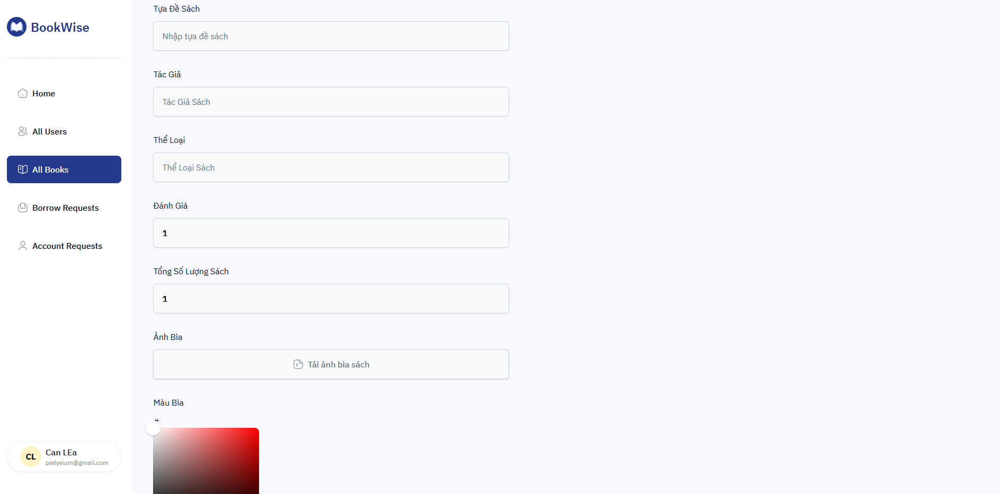

## Dự Án - [`Thư Viện Trường Đại Học`](https://university-library-nine-ecru.vercel.app/)


## Công Nghệ Sử Dụng

- `Typescript`
- `Nextjs` - Phiên bản 15.1.6
- `Tailwindcss` - Sử dụng thư viện [`shadcn`](https://ui.shadcn.com/)
- `Postgresql` - Sử dụng [`Neon - Serverless`](https://neon.tech/) để tạo serverless, setup database
- [`Resend`](https://resend.com/) [`Upstash`](https://upstash.com/) - Sử dụng để gửi mail (Gửi mail chào mừng người dùng đã đăng ký, người dùng đã không active trong 1 khoảng thời gian nhất định)
- [`Authjs - Next Auth`](https://authjs.dev/) - Hệ thống đăng nhập, đăng ký
- [`Vercel`](https://vercel.com/) - Hosting dự án
- [`ImageKit`](https://imagekit.io/) - Lưu trữ hình ảnh (Cloud Storage)

<br>
<div> <br><div>


## Trạng thái dự án - Thông Tin dự án

- Dự án vẫn đang trong trạng thái phát triển, sẽ bổ sung khi có thể.

- Dự án về thư viện cho trường đại học/cao đẳng. Cho phép người dùng (sinh viên) mượn sách. Kiểm soát thông tin mượn sách và trạng thái mượn sách cho từng sinh viên, phê duyệt yêu cầu duyệt thành viên.



## Sử Dụng Dự Án

- Đọc file `config.ts`, theo cấu hình các config mà bổ sung endpoint, key, token. Tạo file `.env.local` và bổ sung vào đó

- Sẽ có vài tính năng hiện tại chưa được bổ sung, sẽ bổ sung vào tương lai gần~


## file .env.local

**Trong trường hợp bạn không biết cấu hình thế nào:**


```NEXT_PUBLIC_IMAGEKIT_URL_ENDPOINT= 
NEXT_PUBLIC_IMAGEKIT_PUBLIC_KEY=
IMAGEKIT_PRIVATE_KEY=

NEXT_PUBLIC_API_ENDPOINT=http://localhost:3000

DATABASE_URL=
AUTH_SECRET=

UPTASH_REDIS_URL=
UPTASH_REDIS_TOKEN=

QSTASH_URL=
QSTASH_TOKEN=
QSTASH_CURRENT_SIGNING_KEY=
QSTASH_NEXT_SIGNING_KEY=

RESEND_TOKEN=

NEXT_PUBLIC_PROD_API_ENDPOINT=(Đây là endpoint khi xuất thành product deploy lên hosting, ở đây mình dùng vercel)
```

- <ins>env.local</ins> - File config